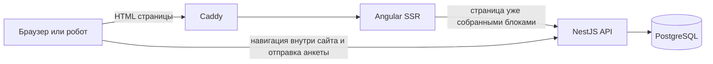
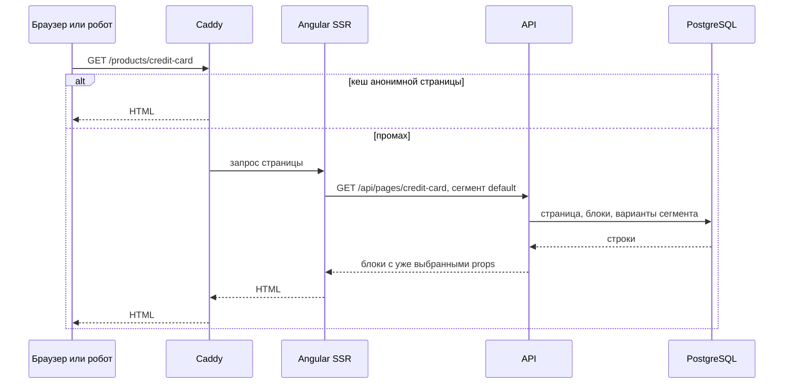
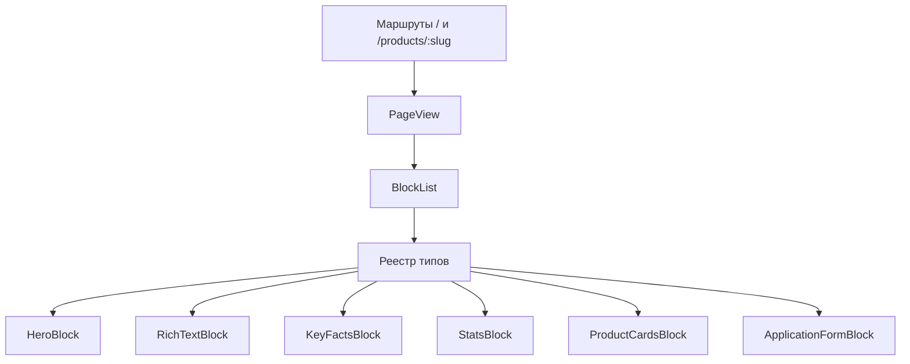

# Витрина продуктов банка

Бриф: маркетинговый сайт одного банка. Главная и страницы продуктов собираются из общих блоков, порядок и состав блоков приходят с сервера. Страницы продуктов устроены по-разному. Контент индексируется поисковиками, отдельные слоты персонализируются, на странице продукта может быть сложная анкета.

Это не конструктор произвольных сайтов. Это витрина с закрытым каталогом блоков: сервер решает, какие блоки стоят на странице и с какими данными, клиент умеет только их нарисовать.

Документ идёт в том же порядке, что и секция system design: требования, верхний уровень, технологии, компоненты и данные, API, производительность, безопасность.

## 1. Требования, которые система обязана закрыть

Пользователь открывает главную и страницы продуктов без учётной записи. На главной в одном списке смешаны разные виды предложений: карты, кредиты, вклады, лизинг, рассрочка. Порядок карточек и сам набор задаёт сервер. Вид продукта — поле карточки, а не отдельный сайт и не отдельный маршрут.

Пользователь открывает любой из этих продуктов и читает страницу. У кредитной карты, кредита и лизинга разный набор блоков, хотя блоки берутся из одного каталога.

Страница продукта доступна поисковому роботу как готовый HTML: заголовок, описание, основной текст, канонический адрес.

Если о посетителе известен сегмент, отдельные баннеры и тексты могут отличаться. Условия продукта, которые видит робот и которые видит человек, совпадают.

### SEO

Витрина продаёт продукты через поиск. Запрос вроде «кредит наличными», «вклад» или «лизинг авто» должен открывать страницу предложения, а не кабинет интернет-банка. SEO для этого сайта — требование первой сборки, наравне со списком продуктов и анкетой. В статье на LinkedIn это нужно назвать прямо: поисковая оптимизация здесь не отчёт после запуска и не отдельная платформа, которую можно подключить потом.

Робот получает готовый HTML и не обязан исполнять JavaScript, чтобы прочитать условия. В первом ответе есть `title`, описание, текст продукта, канонический адрес и JSON-LD. У каждой публичной страницы свой адрес: `/` и `/products/:slug`. Карта сайта перечисляет эти адреса. Анкета и сессия в индекс не входят.

Условия, которые видит робот, совпадают с вариантом `default` для человека. Персональный текст может заменить рекламный абзац и не может заменить ставку, цену и юридическую оговорку. Отдельной страницы для Google нет.

Следствие: страницу собирает Angular SSR. Статического файлового сервера и чистого клиентского рендера недостаточно. Цена — Node-процесс на VPS, свои мета-теги и время на гидрацию. Пока в HTML варианта `default` нет заголовка и текста продукта, требование не выполнено.

На странице продукта может быть анкета. Состав полей зависит от продукта, не от вида «карта или кредит» как от отдельной программы. Анкета видна без входа. Нажатие «оформить» без сессии открывает модалку авторизации и не отправляет ответы. После входа те же ответы уходят на сервер и проверяются той же схемой полей, что описана в блоке.

Вне первой версии: визуальный редактор страниц, произвольный HTML от маркетинга, интернет-банк, платежи, несколько банков в одном инстансе, микросервисы и микрофронтенды.

## 2. Верхнеуровневый дизайн

Четыре процесса на одном VPS.



Публичный запрос страницы:



После первой отрисовки Angular гидратируется. Переход на другую продуктовую страницу идёт по тому же API, без нового SSR-документа на каждый клик. Робот и первый заход получают HTML с сервера.

Роли процессов:

| Процесс | Задача |
| --- | --- |
| Caddy | TLS, раздача, кеш анонимного HTML |
| Angular SSR | Собрать HTML из готового списка блоков, отдать title и meta |
| NestJS API | Страница, персонализация слота, приём анкеты, валидация |
| PostgreSQL | Страницы, продукты разных видов, порядок блоков, варианты, пользователи, сессии, отправки анкет |

Редактор контента в первой версии отсутствует. Страницы заливаются миграцией-сидом. Модель данных при этом уже редакторская: страница, упорядоченные блоки, варианты. Следующий контур — API редактора поверх тех же таблиц, без смены рендерера.

### Почему персонализация не перекраивает всю страницу

Персональным делается слот, а не документ.

Фактические условия продукта лежат в блоках без вариантов. Их видят и человек, и робот. Вариант разрешён у баннера и у короткого текста. У анкеты вариантов нет: набор полей продукта один, иначе юридические условия поедут между сегментами.

Робот и посетитель без сегмента получают вариант `default`. Отдельной «версии для Google» нет. Это защита от клоакинга: поисковику нельзя показывать другие условия, чем людям.

Ключ кеша HTML: адрес страницы плюс сегмент. Сегментов мало (`default`, `salary`, `premium`), поэтому кеш не разваливается на копию страницы на каждого человека.

Компонент блока про сегмент не знает. API до отрисовки подставляет конкретные `props`.

Следствие: персональный баннер не ломает индексируемый текст. Цена: маркетингу нельзя персонализировать юридический блок и поля анкеты. Это ограничение продукта, его надо уметь проговорить.

### Почему страница одна, а маршруты не плодятся

Все продукты открываются маршрутом `products/:slug`. Различие страниц — это разный список блоков в ответе API, а не разные Angular-модули на каждый банковский продукт. Новый вклад добавляется строками в базе, без релиза фронтенда, пока он собран из уже существующих типов блоков.

Новый тип блока требует релиза: компонент, запись в реестре, схема в общем контракте. Это сознательная цена закрытого каталога.

## 3. Технологии

Стек: Angular со SSR, NestJS, PostgreSQL, общий пакет контракта на TypeScript, монорепозиторий на pnpm, Docker Compose, Caddy, GitHub Actions.

### Angular на фронтенде

Задача фронтенда здесь — реестр блоков и одна страничная оболочка.

Сервер присылает список `{ type, props }`. Оболочка держит таблицу `type -> компонент` и рисует готовые standalone-компоненты. Страница продукта не имеет собственной вёрстки: у неё есть только порядок блоков. Для этого в Angular достаточно реестра и `NgComponentOutlet`. Добавление типа блока локализовано: компонент, схема props, одна строка реестра.

Анкеты в этом брифе сложные и разные по продуктам. Поля приходят схемой. Angular-формы нормально живут с условными контролами, валидацией и отправкой одного блока, не превращая страницу в набор самодельных инпутов.

Требование SEO из раздела 1 закрывается официальным SSR (`@angular/ssr`). Публичная страница рендерится в Node до ответа браузеру. В HTML сразу лежат заголовок, описание, текст продукта и JSON-LD.

DI используется узко: реестр блоков и клиент API. Данные страницы в компоненты прокидываются готовыми props, а не достаются каждым блоком из своего сервиса.

Следствие выбора: на VPS работает Node-процесс SSR, статического nginx недостаточно. Мета-теги, каноникал и sitemap пишем сами. Гидрация маркетинговой страницы стоит денег, поэтому блоков на первом экране мало, а «дашборд» на витрине — это несколько чисел в HTML, не библиотека графиков.

Калькулятор, если он появится, гидратируется отдельно и не является LCP-элементом. Текст продукта к этому моменту уже в HTML.

Рассматривался Next.js. Для чистого контентного сайта у него сильнее привычный SEO-контур и ISR. В этом брифе узкое место другое: закрытый каталог блоков и схемные анкеты, которые будут жить годами. Angular это держит прямой моделью компонентов и форм. ISR можно добавить позже как кеш варианта `default`, он не обязан быть фреймворком.

Рассматривался чистый CSR на Angular. Он не закрывает требование индексации: робот не должен быть обязан исполнять приложение, чтобы прочитать условия вклада.

Ограничение автора тоже зафиксировано честно: целевые собеседования идут на Angular. Технический выбор выше с этим совпадает, а не подменяет его.

### NestJS на бэкенде

Контракт блока — дискриминированный union на TypeScript. Его импортируют и API, и Angular. Один пакет `packages/contract` значит, что сервер не сможет объявить тип `stats`, которого нет в реестре фронтенда, не сломав сборку.

Границы модулей совпадают с контурами системы: страницы и анкеты. Рендерер HTML в API не входит.

Следствие: один язык на схему, валидацию и UI. Цена: в портфолио не появляется отдельный банковский бэкенд на Java или C#. Для этого брифа выигрыша от второго языка нет, схема как раз должна быть общей.

Рассматривался готовый headless CMS. Он закрыл бы хранение контента и спрятал ровно тот дизайн, который здесь нужно показать: реестр, вариант сегмента, валидация анкеты, SSR. Свой API на этих таблицах короче, чем изучение чужой админки.

### PostgreSQL

Меняется содержимое блока. Не меняется устройство витрины: у страницы один slug, у блока есть позиция, у варианта есть сегмент, у отправки анкеты есть время и тело.

Это реляционные инварианты. Их проверяет база.

| Данные | Где живут | Кто проверяет |
| --- | --- | --- |
| slug страницы, публикация, тип страницы | колонки | уникальность и ограничения Postgres |
| позиция блока на странице | колонка `position` | уникальность `(page_id, position)` |
| props конкретного типа блока | `jsonb` | TypeScript-контракт и разбор на границе API |
| вариант баннера для сегмента | строка варианта | первичный ключ `(block_id, segment)` |
| ответы анкеты | `jsonb` в отправке | та же схема полей, что у блока формы |

`jsonb` нужен потому, что у `hero` и у `applicationForm` разные props. Отдельная база под это не нужна.

Публикация страницы вместе с блоками — одна транзакция. Уникальный slug и порядок блоков — ограничения, а не договорённость в коде сервиса.

Рассматривался MongoDB из-за «гибкой структуры страниц». Гибкость здесь заканчивается на props. Страница, порядок и сегмент гибкими быть не должны. Транзакция публикации и уникальность slug в Postgres короче и строже.

SQLite не берём даже локально. В Docker с первого дня тот же Postgres, что на VPS, чтобы миграции не жили в двух диалектах.

Доступ к базе: SQL-миграции и запросы из API. ORM не ставим. Схема в статье и схема в репозитории должны совпадать дословно.

### Монорепозиторий

```text
apps/web              Angular SSR
apps/api              NestJS
packages/contract     типы блоков и схемы анкет
docker-compose.yml    Caddy, web, api, Postgres
```

pnpm workspaces, без Nx. Инструмент монорепозитория не должен быть сложнее самой витрины.

Следствие: контракт версионируется вместе с фронтендом и API. Цена: релиз общего типа блока трогает оба приложения. Для одного автора это проще, чем два репозитория и расходящиеся DTO.

### Что стоит на VPS

Docker Compose: `caddy`, `web`, `api`, `postgres`. GitHub Actions прогоняет проверку контракта и сборку образов, затем выкладывает compose. Секреты и пароль базы в репозиторий не попадают.

Первая версия выдерживает витрину одного банка. Отдельные сервисы на «контент», «персонализацию» и «анкеты» не заводятся: это три модуля одного API. Делить их имеет смысл, когда анкеты и рендер начнут мешать друг другу по нагрузке. Сейчас они не мешают.

## 4. Компоненты фронтенда



`PageView` один на главную и на продукт. Адрес `/` читает страницу со slug `home`. Адрес `/products/:slug` читает страницу продукта. Снаружи это разные маршруты, внутри оба получают один и тот же `PageDocument`.

Блок получает уже разрешённые props и сам за данными страницы не ходит. Исключение — `ApplicationFormBlock`: по кнопке оформления он либо открывает модалку входа, либо отправляет ответы на `POST /api/applications`. Чтение страницы к этому запросу не привязано.

Неизвестный `type` пропускается, ошибка пишется в лог сервера отрисовки, остальные блоки страницы остаются на месте. Черновик нового блока в базе не роняет витрину.

Каталог первой версии:

| Тип | Зачем | Персональные варианты |
| --- | --- | --- |
| `hero` | первый экран, заголовок H1 | нет, это индексируемый заголовок |
| `richText` | условия и пояснения | да, только рекламный абзац, не оферта |
| `keyFacts` | «дополнительная информация», список фактов | нет |
| `stats` | несколько показателей продукта | нет |
| `productCards` | главная, смесь видов продуктов, переход на `/products/:slug` | порядок карточек может отличаться по сегменту |
| `applicationForm` | анкета, поля из props | нет |

Демонстрация брифа — одна главная и несколько продуктов разных видов вперемешку. Составы страниц при этом разные:

- кредитная карта: `hero`, `keyFacts`, `applicationForm`;
- кредит: `hero`, `stats`, `applicationForm`;
- вклад: `hero`, `stats`, `richText`, `applicationForm`;
- лизинг и рассрочка собираются из тех же блоков, другим порядком.

Один маршрут `products/:slug` на все виды. Отдельного приложения «только карты» нет.

Контракт, общий для API и реестра:

```ts
type Block =
  | { id: string; type: 'hero'; props: { title: string; subtitle: string } }
  | { id: string; type: 'richText'; props: { paragraphs: string[] } }
  | { id: string; type: 'keyFacts'; props: { title: string; items: { label: string; value: string }[] } }
  | { id: string; type: 'stats'; props: { items: { label: string; value: string }[] } }
  | { id: string; type: 'productCards'; props: { cards: ProductCard[] } }
  | { id: string; type: 'applicationForm'; props: { title: string; fields: FormField[] } };

type FormField =
  | { name: string; kind: 'text'; label: string; required: boolean }
  | { name: string; kind: 'select'; label: string; required: boolean; options: string[] }
  | { name: string; kind: 'checkbox'; label: string; required: boolean };

type ProductCategory = 'card' | 'loan' | 'leasing' | 'installment' | 'deposit';

type ProductCard = {
  slug: string;
  title: string;
  summary: string;
  category: ProductCategory;
  highlight: string;
};

type PageDocument = {
  slug: string;
  title: string;
  description: string;
  blocks: Block[];
};
```

`highlight` — одна строка на карточке («льготный период 120 дней», «от 12% годовых», «первый взнос от 10%»). Она закрывает разницу видов на главной без отдельного компонента на каждый вид.

Карточка на главной не хранится второй копией внутри JSON блока. API собирает `productCards` из таблицы `products`: опубликованные строки с `home_position`, в этом порядке. Страница продукта связана с продуктом через `products.page_id`. Заголовок карточки и заголовок страницы живут в одном месте и не разъезжаются.

## 5. Модель базы

```text
pages
  id            uuid pk
  slug          text unique
  title         text
  description   text
  published     boolean

products
  id              uuid pk
  slug            text unique
  category        text
  title           text
  summary         text
  highlight       text
  terms           jsonb
  page_id         uuid -> pages.id
  home_position   int null
  published       boolean

blocks
  id            uuid pk
  page_id       uuid -> pages.id
  position      int
  type          text
  props         jsonb
  unique (page_id, position)

block_variants
  block_id      uuid -> blocks.id
  segment       text
  props         jsonb
  primary key (block_id, segment)

users
  id            uuid pk
  email         text unique
  password_hash text

sessions
  id            uuid pk
  user_id       uuid -> users.id
  created_at    timestamptz

submissions
  id            uuid pk
  block_id      uuid -> blocks.id
  user_id       uuid -> users.id
  answers       jsonb
  created_at    timestamptz
```

`products` отделена от `pages`. Страница — это композиция блоков. Продукт — это предложение: вид, короткое описание, строка для карточки, ссылка на свою страницу и место на главной. `home_position = null` значит, что продукт опубликован, но на главную не выведен. У занятых позиций уникальный индекс.

`terms` — jsonb с дискриминатором того же `category`, что и колонка продукта. У карты это льготный период, у кредита ставка и сумма, у лизинга взнос, у рассрочки срок, у вклада ставка. Контракт отвергает запись, где вид в колонке и вид внутри `terms` не совпали.

Отдельной таблицы на карты, кредиты, лизинг, рассрочку и вклады нет. Новый вид — новое значение `category` и другая раскладка блоков на его странице, а не новая таблица и не новый фронтенд. Своя таблица появится, если у вида появятся колонки, по которым нужен отдельный индекс и ограничение, и jsonb это уже не удержит. Пока такого поля нет: на главной вид нужен как фильтр и подпись, а это одна колонка `category`.

`users` и `sessions` существуют из-за модалки оформления, не из-за разнообразия продуктов. Пароль хранится только как хеш. Сессия — cookie, не поле, которое клиент сам придумывает.

`type` в базе — текст. Список допустимых типов живёт в `packages/contract`. База не дублирует union: иначе каждая новая карточка блока — это миграция enum. Цена: база пропустит опечатку в типе. Её ловит разбор JSON на границе API до записи и до отдачи страницы. Неизвестный тип на чтении пропускается рендерером.

Индекс для витрины: уникальный `pages.slug`. Страница читается одним запросом: страница, её блоки по `position`, варианты этих блоков для одного сегмента.

Отправки анкет не обновляются. Исправление данных человека — новая договорённость о хранении, не `UPDATE` ответа.

## 6. API

```http
GET /api/pages/:slug
Header: X-Segment: default | salary | premium
```

Ответ — `PageDocument`. Вариант сегмента уже влит в `props`. Клиент повторно персонализацию не считает.

Сегмент без заголовка равен `default`. Значение вне известного списка тоже равно `default`. SSR читает cookie сегмента и передаёт тот же заголовок. Робот остаётся на `default`.

```http
POST /api/applications
Cookie: session=...
{ "blockId": "...", "answers": { "fullName": "...", "income": "..." } }
```

Без сессии ответ `authentication_required` и пустая база. Клиент на этот статус открывает модалку, после входа повторяет тот же запрос. API загружает блок, убеждается, что это `applicationForm`, проверяет ответы его схемой полей и пишет строку в `submissions` от `user_id` сессии. Лишние ключи в `answers` отбрасываются. Клиентская проверка только уменьшает число пустых отправок и не заменяет серверную.

Значение cookie `session` — это `sessions.id`. Пользователь берётся из этой строки. Идентификатора в теле нет. Неизвестная или битая cookie для API то же самое, что отсутствие cookie: `401` и `{ "status": "authentication_required" }`.

Остальные ответы `POST`:

- `201` и `{ "status": "accepted", "submissionId" }`, если схема полей прошла;
- `422` и `{ "status": "invalid", "fieldErrors" }`, если поля не сошлись или блок не анкета;
- `404`, если блока с таким id нет;
- `429` и `{ "status": "rate_limited" }`, если с одного адреса пришло больше 30 таких запросов за минуту.

Лимит живёт в памяти одного процесса. На первом деплое инстанс API один, общий счётчик не нужен. Цена: перезапуск обнуляет окно, а второй инстанс удвоит допустимую частоту. Когда процессов станет больше, счётчик переедет в общее хранилище.

`GET` неизвестного или снятого с публикации slug отвечает `404`. Карточки `productCards` в ответе собираются из опубликованных `products` с `home_position`, а не из jsonb блока. Заголовок `X-Segment` вне списка `default | salary | premium` читается как `default`. Вариант, если он есть, подменяет props блока целиком.

Эндпоинта входа в этом шаге нет. Модалка появится вместе с Angular. До неё сессию для проверки `POST` можно создать только строкой в `sessions`.

Редакторские `PUT` в этот контракт не входят, пока нет редактора. Таблицы под них уже есть.

## 7. Производительность

Допущение: один банк, десятки продуктовых страниц, пик рекламной кампании порядка десятков запросов в секунду, почти все посетители анонимные. Это витрина, не контур платежа.

Узкое место при таком размере — SSR и кеш, не Postgres. Выборка страницы по уникальному slug и десяток блоков — дешёвый запрос. Дороже собрать и отдать HTML и гидрацию.

Порядок оптимизаций, если измерение покажет проблему:

1. Кеш HTML варианта `default` на Caddy. Робот и анонимный посетитель попадают в него.
2. Держать число сегментов маленьким, чтобы персональные копии не вытеснили общий кеш.
3. Не подключать графики и тяжёлые виджеты к блоку `stats`.
4. LCP — заголовок или изображение hero в первом HTML, без ожидания отдельного запроса блока.
5. Ниже первого экрана блоки можно откладывать. Текст для индексации при этом остаётся в документе.

Оценку «выдержит ли» имеет смысл называть вместе с допущением про десятки rps. Пока страниц десятки, репликация базы и несколько инстансов SSR не нужны. Второй инстанс `web` появляется, когда по метрикам CPU SSR упирается в одно ядро на промахах кеша.

Что измерять с первого деплоя: TTFB HTML, долю попаданий в кеш, время запроса `GET /api/pages/:slug`, размер JSON страницы. Core Web Vitals на витрине смотреть по LCP героя и по INP калькулятора, когда он появится.

## 8. Безопасность

Контент рисуют свои компоненты из структурированных props. Маркетинг не сохраняет HTML. Для `richText` допустимы абзацы текста, не разметка. Это закрывает сохранённый XSS из админки, которой пока нет, и из сида, который есть.

Заголовок `Content-Security-Policy` запрещает посторонние скрипты. Страница не вставляет скрипты из props.

Анкета:

- схема полей на сервере главнее схемы в браузере;
- в логи не попадает тело `answers`;
- `POST` ограничен по частоте с одного адреса;
- чужие отправки по HTTP не читаются, отдельного `GET /submissions/:id` для витрины нет;
- отправка пишется только от `user_id` текущей сессии, клиентский идентификатор пользователя в тело не принимается.

Сегмент в cookie или заголовке — это подсказка витрины, не авторизация. Подмена сегмента меняет баннер и не открывает данные другого человека. Когда появится настоящий вход, сегмент нельзя будет выводить из клиентского поля без проверки сессии.

Кеш не смешивает персональный HTML с анонимным. Иначе один посетитель получит баннер другого сегмента. Ключ кеша это и фиксирует.

Робот видит те же условия продукта, что и человек на варианте `default`. Персональный слот не используется для цены, ставки и юридической оговорки.

Пароль базы, TLS-ключи и секреты деплоя в репозиторий и в образ не кладутся.

## 9. Что из этого следует для первой сборки

Первая сборка доказывает бриф, а не админку.

В ней есть: контракт блоков и видов продуктов, таблицы выше, сид главной со смешанным списком, `GET /api/pages/:slug` с сегментом, одна Angular-страница с реестром, SSR, модалка входа на оформлении, `POST` анкеты только с сессией, Compose на VPS.

В ней нет: редактора, отдельного кабинета интернет-банка, калькулятора, картиночного CDN, очереди, микросервисов, отдельного фронтенда на каждый вид продукта.

Контракт, таблицы, сид и API уже в репозитории. Angular SSR в `apps/web` рисует `/` и `/products/:slug` одним `PageView` и тем же пакетом контракта. В первом HTML есть заголовок и текст продукта. Кнопка оформления без сессии открывает модалку и не отправляет анкету. Эндпоинт входа ещё не подключён: сессия по-прежнему строка в `sessions`.

Публичный текст для статьи берётся из этого файла. Код, который появится следом, должен совпадать с решениями выше. Если решение меняется, сначала меняется этот документ: что выбрали, почему, какое следствие, чем платим.
